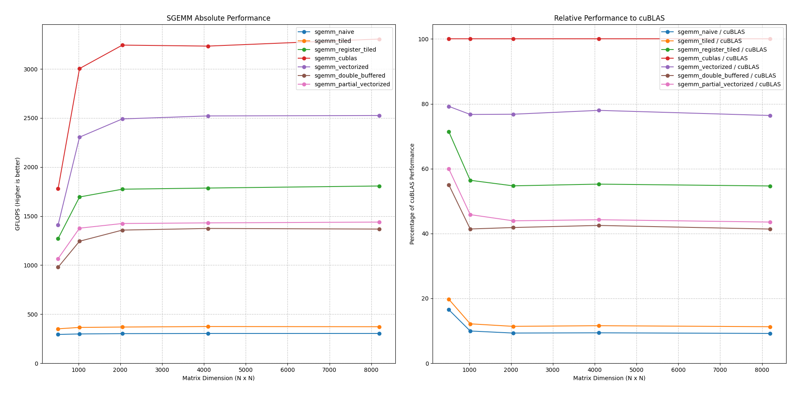

# SGeMM
A set of GPU kernels that do matrix multiplication - **S**ingle precision **Ge**neral **M**atrix **M**ultiplication.

A toy project to learn about GPU kernel optimization and how GPUs work under the hood.

Each kernel uses a different technique in order to try and squeeze the last bit of performance from the GPU.

---
## Kernels
The following is a slightly technical overview of the different optimizations that I used.

### Naive
The naive implementation is exactly what you'd expect.

The GPU computes one output element per thread.

### Tiled
The tiled implementation loads a tile of memory from global memory into shared memory.

This reduces the memory latency.

### Register Tiled
This builds on top of the previous tiled implementation by loading parts of the shared memory into registers.

This improves the number of FLOPS that can be computed per byte of data thats loaded.

### Vectorized
This kernel uses vectorized loads and stores (128 bits at once instead of 32).

I also transposed the shared memory matrix so that the loads would be contiguous - helps for vectorization. - (sgemm_partial_vectorized.cu)

This is currently the best performing kernel - consistently hitting around 80% of the CuBLAS implementations.

### Double Buffered
This kernel uses twice the shared memory, basically buffering the loads and compute so that the two can happen in parallel.

For some reason this didn't really improve the performance - might be due to the increased shared memory usage, or maybe something wrong with my implementation

Will have to profile this kernel properly later.

### Warptiling (WIP)
Need to do more research on this, but the point is to make use of [warps](https://modal.com/gpu-glossary/device-software/warp) - the basic unit of execution in GPUs.

---

## Prerequisites
Before building, ensure you have the following installed:
* **CUDA Toolkit:** [Installation Guide](https://docs.nvidia.com/cuda/cuda-quick-start-guide/index.html)
* **C++ Compiler:** (e.g., GCC, Clang, or MSVC)
* **CMake:** Version 3.10 or higher
* **Python:** With pandas and matplotlib for the benchmarking code

## Building the Project

Follow these steps to compile the source code:

```bash
# Configure the build directory
cmake -S . -B build

# Compile the project
cmake --build ./build
```

## Benchmarking
For benchmarking, (might take a bit of time when you run this)

The results get cached though so you can benchmark only the kernels that are changed.

Or if you just want to see the results here they are.



```bash
# python bench.py [kernels that you want to benchmark - cublas naive tiled register_tiled partially_vectorized vectorized double_buffered]
python bench.py cublas vectorized register_tiled 
```

# Usage
Not much point in runningt the kernels without benchmarking but here's how you do it.
```bash
# ./build/sgemm_{kernel_name} M N K -v (the -v or --verify option verifies if the kernel is correct by comparing with a cpu implementation)
./build/sgemm_vectorized 512 512 512 -v
```

---
# References
[Modal's GPU Glossary](https://modal.com/gpu-glossary/readme)

https://siboehm.com/articles/22/CUDA-MMM

https://lumetta.web.engr.illinois.edu/508/slides/lecture4-x4.pdf\

https://salykova.github.io/sgemm-gpu

Note: I used AI for a part of the Python benchmarking code and the Cmake configuration.
